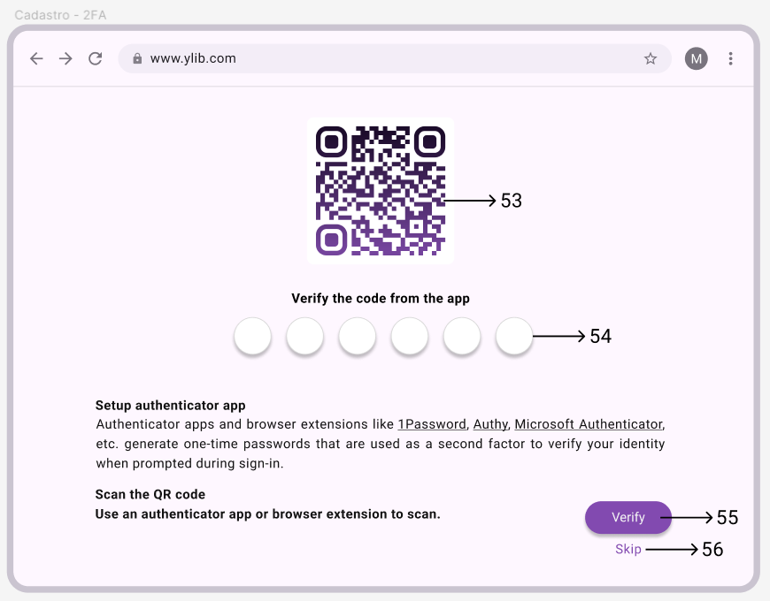

# yLib - Sistema de Gerenciamento de Biblioteca

Este sistema é projetado para gerenciar as operações de uma biblioteca, incluindo cadastro de usuários, livros, autores, gêneros, categorias e reservas. O sistema oferece funcionalidades para login, consulta avançada e controle de transações.

## Funcionalidades

1. **Página Inicial (Home)**
   - Visão geral das funcionalidades disponíveis.
   - Acesso a pesquisa (básica e avançada) e livros disponíveis.
   - **Bibliotecários:** gerenciamento de acervo e de reservas feitas.

2. **Cadastro de Usuários**
   - Permite registro e gerenciamento de usuários.
   - Possui campos como Nome, E-mail, CPF e Senha.
   - Suporta cadastro e autentificação via dois fatores, com recuperação de conta.

3. **Cadastro de Livros**
   - Permite inclusão, atualização, listagem e exclusão de livros registrados no acervo.
   - Cada livro possui campos como Autor, Gênero, Título, ISBN, Ano de Publicação e Imagem.

4. **Cadastro de Autores**
   - Funcionalidade para gerenciar dados dos autores.
   - Inclui campos como ID, Nome, País e Data de Nascimento.

5. **Cadastro de Categorias**
   - Funcionalidade para gerenciar categorias dos livros.
   - Inclui campos como ID e Descrição.

6. **Empréstimos de Livros**
   - Registra e gerencia os empréstimos de livros.
   - Contém campos como ID, Usuário, Livro, Data de Empréstimo, Data de Devolução e Data de Retorno.

7. **Consultas Avançadas**
   - Consultas utilizando filtros e JOINs com múltiplos critérios como data, categoria, estado, cidade, etc.

8. **Controle de Transações**
   - Implementação de controle de transações nas operações críticas para garantir a integridade dos dados.

## Estrutura do Projeto

### Modelos (Models)
Os modelos representam as entidades do banco de dados e são utilizados na camada de negócio para manipular os dados.

- **UserViewModel**
- **BookViewModel**
- **AuthorViewModel**
- **CategoryViewModel**
- **LoanViewModel**
- **ErrorViewModel**

### Data Access Objects (DAOs)
Os DAOs encapsulam o acesso aos dados e executam operações no banco de dados utilizando Stored Procedures.

- **PadraoDAO<T>** (Classe base)
- **UserDAO**
- **BookDAO**
- **AuthorDAO**
- **CategoryDAO**
- **LoanDAO**

## Imagens do Front-end
É possível acessar o design das telas a partir do projeto feito na plataforma Figma:
- https://www.figma.com/design/klilonpkdDiKrrugSIVqUb/Biblioteca?node-id=53-838&t=4NRoUJpkUGNS4c3D-1

Página Home c/ pesquisa avançada

Página Home - Gerenciamento de Acervo

Página do Livro Selecionado

Página do Livro Selecionado p/ Bibliotecário

Página de Registro de Livro

Página de Login

Página de Cadastro

Página de Autentificação em 2 Fatores

Página de 2FA c/ Código QR

Página de Recuperação de Conta 2FA

## Dicionário de dados
| **Nome Campo**                   | **Origem do Dado(opc)** | **Tipo** | **Default**                   | **Máscara Edição** | **Brancos** | **Tamanho** | **Consistência**                                   |
|----------------------------------|-------------------------|----------|-------------------------------|--------------------|-------------|-------------|----------------------------------------------------|
| 1. Ícone de Perfil               | Sistema                 | btn      |                               |                    |             |             |                                                    |
| 2. Menus Laterais                | Navegação               | btn      |                               |                    |             |             | Abrir e fechar opções de navegação                 |
| 3. Campo de Busca                | Digitado                | txt      | Search book...                | N                  | N           | 50          | Opcional, página atualizada conforme é preenchida  |
| 4. Botão "Filter"                | Ação do Usuário         | btn      |                               |                    |             |             |                                                    |
| 5. Campo Autor                   | Digitado                | txt      | Search author...              | N                  | S           | 30          | Opcional                                           |
| 6. Campo ISBN                    | Digitado                | txt      | Search ISBN...                | N                  | S           | 13          | Opcional                                           |
| 7. Campo Editor                  | Digitado                | txt      | Search editor...              | N                  | S           | 30          | Opcional                                           |
| 8. Campo Categoria/Gênero        | Digitado                | txt      | Search genre/category...      | N                  | S           | 30          | Opcional                                           |
| 9. Aba "Latest"                  | Ação do Usuário         | btn      |                               |                    |             |             |                                                    |
| 10. Aba "Popular"                | Ação do Usuário         | btn      |                               |                    |             |             |                                                    |
| 11. Aba "Reserves"               | Ação do Usuário         | btn      |                               |                    |             |             |                                                    |
| 12. Botão "Apply Filters"        | Ação do Usuário         | btn      |                               |                    |             |             | Mínimo um dos campos deve ser preenchido           |
| 13. Livros Listados              | Dados do Banco          | txt, img |                               | N                  | N           | 20          |                                                    |
| 14. Botão "Register Book"        | Ação do Usuário         | btn      |                               |                    |             |             | Visível para bibliotecário                         |
| 15. Aba "Manage Books"           | Ação do Usuário         | btn      |                               | N                  |             |             | Visível para bibliotecário                         |
| 16. Aba "Manage Reserves"        | Ação do Usuário         | btn      |                               | N                  |             |             | Visível para bibliotecário                         |
| 17. Botão "Delete Book"          | Ação do Usuário         | btn      |                               |                    |             |             | Visível para bibliotecário                         |
| 18. Botão "Edit Book"            | Ação do Usuário         | btn      |                               |                    |             |             | Visível para bibliotecário                         |
| 19. Botão Seta                   | Ação do Usuário         | btn      |                               |                    |             |             |                                                    |
| 20. Imagem da capa               | Dados do Banco          | img      |                               | N                  | N           |             | Não vazio                                          |
| 21. Título do Livro              | Dados do Banco          | txt      |                               | N                  | N           | 50          | Não vazio                                          |
| 22. Autor do Livro               | Dados do Banco          | txt      |                               | N                  | N           | 30          | Não vazio                                          |
| 23. ISBN do Livro                | Dados do Banco          | txt      |                               | N                  | N           |             | Não vazio                                          |
| 24. Gênero do Livro              | Dados do Banco          | txt      |                               | N                  | N           | 30          | Não vazio                                          |
| 25. Ano de Publicação do Livro   | Dados do Banco          | txt      |                               | N                  | N           | 30          | Não vazio                                          |
| 26. Descrição do livro           | Dados do Banco          | txt      |                               | N                  | N           | 1000        | Não vazio                                          |
| 27. Unidades disponíveis         | Dados do Banco          | int      | Unavailable for reservation.  | N                  | S           | 50          |                                                    |
| 28. Seção de livros relacionados | Dados do Banco          | txt, img | No recommendations available. | N                  | S           | 5           |                                                    |
| 29. Botão “Reserve Book”         | Ação do Usuário         | btn      |                               |                    |             |             | Visível apenas para bibliotecários                 |
| 30. Campo Título                 | Digitado                | txt      |                               | N                  | N           | 50          | Não vazio                                          |
| 31. Campo ISBN                   | Digitado                | txt      |                               | N                  | N           | 13          | Não vazio                                          |
| 32. Campo Gênero                 | Digitado                | txt      |                               | N                  | N           | 30          | Não vazio                                          |
| 33. Campo Autor                  | Digitado                | txt      |                               | N                  | N           | 30          | Não vazio                                          |
| 34. Campo Ano de Publicação      | Digitado                | txt      |                               | N                  | N           | 30          | Não vazio                                          |
| 35. Capa do Livro                | Inserção de imagem      | img      |                               | N                  | N           |             | Não vazio                                          |
| 36. Botão “Register”             | Ação do Usuário         | btn      |                               |                    |             |             |                                                    |
| 37. Campo Email                  | Digitado                | txt      |                               | N                  | N           | 50          |                                                    |
| 38. Campo Senha                  | Digitado                | pwd      |                               | S                  | N           | 30          |                                                    |
| 39. Opção “Forgot Password”      | Ação do Usuário         | btn      |                               |                    |             |             | Recuperação de senha                               |
| 40. Botão “Login”                | Ação do Usuário         | btn      |                               |                    |             |             |                                                    |
| 41. Opção “Sign Up”              | Ação do Usuário         | btn      |                               |                    |             |             | Autentificação via Banco de Dados                  |
| 42. Campo Nome                   | Digitado                | txt      |                               | N                  | N           | 50          | Não vazio                                          |
| 43. Campo CPF                    | Digitado                | txt      |                               | N                  | N           | 14          | Validação de formato CPF                           |
| 44. Campo Email                  | Digitado                | txt      |                               | N                  | N           | 50          | Validação de formato                               |
| 45. Campo Senha                  | Digitado                | pwd      |                               | S                  | N           | 30          | Autentificação via Banco de Dados                  |
| 46. Campo Confirmar Email        | Digitado                | txt      |                               | N                  | N           | 50          | Validação de formato                               |
| 47. Campo Confirmar Senha        | Digitado                | pwd      |                               | S                  | N           | 30          | Autentificação via Banco de Dados                  |
| 48. Upload de Imagem Usuário     | Inserção de imagem      | img      |                               | N                  | S           |             | Opcional                                           |
| 49. Botão “Register              | Ação do Usuário         | btn      |                               |                    |             |             |                                                    |
| 50. Código 2FA                   | Digitado                | num      |                               | N                  | N           | 6           | Validação de formato e valor                       |
| 51. Botão “Verify”               | Ação do Usuário         | btn      |                               |                    |             |             |                                                    |
| 52. Opção “Recovery code”        | Ação do Usuário         | btn      |                               |                    |             |             | Recuperação de conta 2FA                           |
| 53. QR Code 2FA                  | Gerado                  | img      |                               |                    |             |             |                                                    |
| 54. Campo código 2FA             | Digitado                | txt      | XXXXX-XXXXX                   | N                  | S           | 6           | Validação de formato e valor                       |
| 55. Botão “Verify”               | Ação do Usuário         | btn      |                               |                    |             |             | Autentificação de conta 2FA                        |
| 56. Botão “Skip”                 | Ação do Usuário         | btn      |                               |                    |             |             |                                                    |
| 57. Campo “Recovery code”        | Digitado                | txt      | XXXXX-XXXXX                   | N                  | N           | 10          | Validação de formato e valor                       |
| 58. Botão “Verify”               | Ação do Usuário         | btn      |                               |                    |             |             | Verificar código de recuperação 2FA                |

## Como Executar o Projeto

### Pré-requisitos
- JDK (Java)
- IDE Netbeans

### Passos para Execução
1. Abra o projeto no Netbeans.
2. Compile e execute o projeto.
3. Acesse `http://localhost:8080` no navegador.

### Usuários Administrativos
- Os detalhes de login para usuários administrativos podem ser configurados diretamente no banco de dados ou através da funcionalidade de cadastro de usuários.

## Considerações Finais

Este projeto visa demonstrar um sistema completo de gerenciamento de livraria utilizando boas práticas de programação, controle de transações, consultas avançadas e um design de front-end responsivo e moderno.